# mmdg Samples

This directory contains a suite of samples. The following table compares GitHub's native Mermaid rendering (left) with `mmdg` generated PNGs (right).

*(Note: To regenerate these, run `go run scripts/generate_samples_readme.go` from the root)*

## architecture_complex.mmd

<table>
<tr>
<th width="50%%">GitHub Native (Mermaid JS)</th>
<th width="50%%"><code>mmdg</code> PNG</th>
</tr>
<tr>
<td>

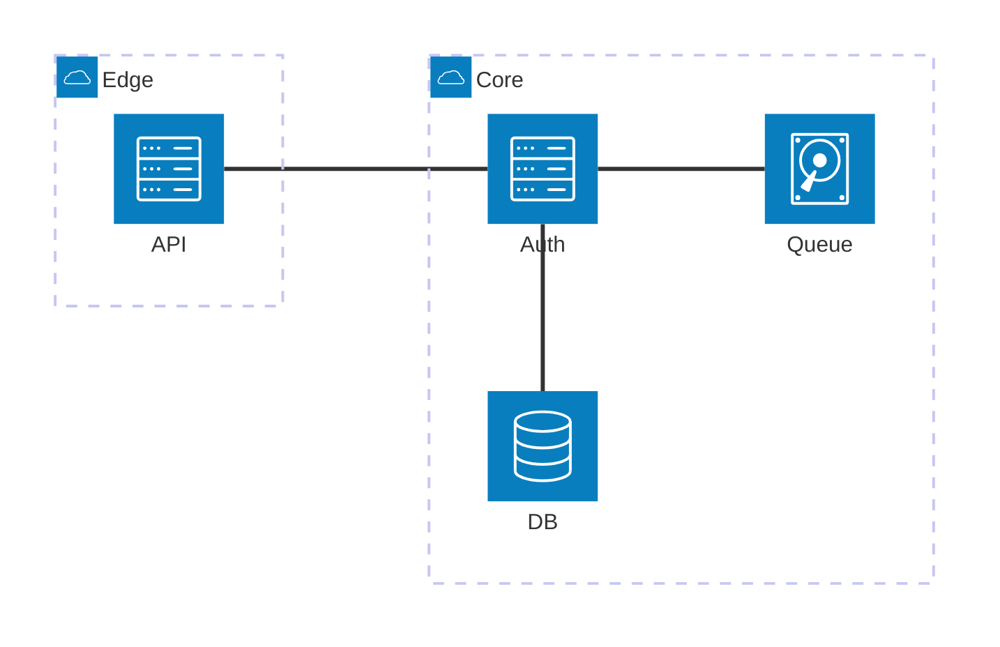
```mermaid
architecture-beta
  group edge(cloud)[Edge]
  group core(cloud)[Core]
  service api(server)[API] in edge
  service auth(server)[Auth] in core
  service db(database)[DB] in core
  service queue(disk)[Queue] in core
  api:R -- L:auth
  auth:B -- T:db
  auth:R -- L:queue
```

</td>
<td>

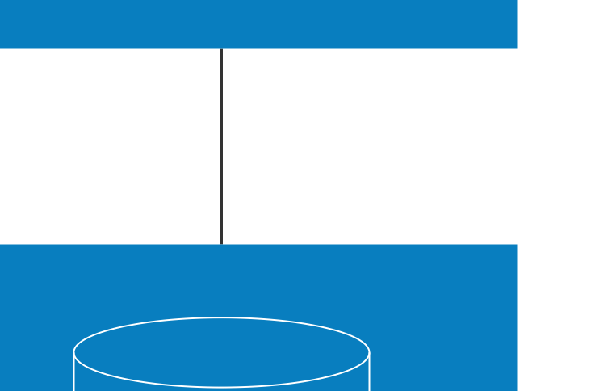

</td>
</tr>
</table>

## block_complex.mmd

<table>
<tr>
<th width="50%%">GitHub Native (Mermaid JS)</th>
<th width="50%%"><code>mmdg</code> PNG</th>
</tr>
<tr>
<td>

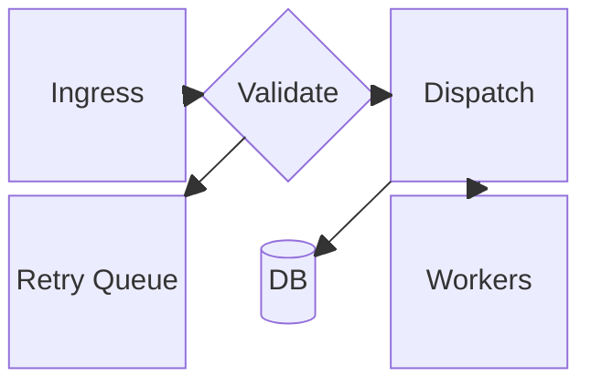
```mermaid
block
  columns 3
  A["Ingress"] B{"Validate"} C["Dispatch"]
  D["Retry Queue"] E[("DB")] F["Workers"]
  A --> B
  B --> C
  B --> D
  C --> E
  C --> F
```

</td>
<td>

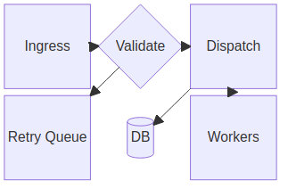

</td>
</tr>
</table>

## c4_context_complex.mmd

<table>
<tr>
<th width="50%%">GitHub Native (Mermaid JS)</th>
<th width="50%%"><code>mmdg</code> PNG</th>
</tr>
<tr>
<td>

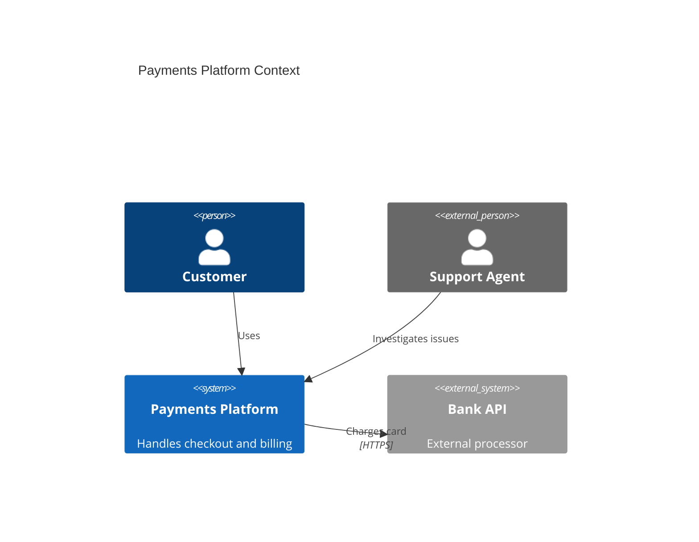
```mermaid
C4Context
  title Payments Platform Context
  Person(customer, "Customer")
  Person_Ext(support, "Support Agent")
  System(system, "Payments Platform", "Handles checkout and billing")
  System_Ext(bank, "Bank API", "External processor")
  Rel(customer, system, "Uses")
  Rel(system, bank, "Charges card", "HTTPS")
  Rel(support, system, "Investigates issues")
```

</td>
<td>

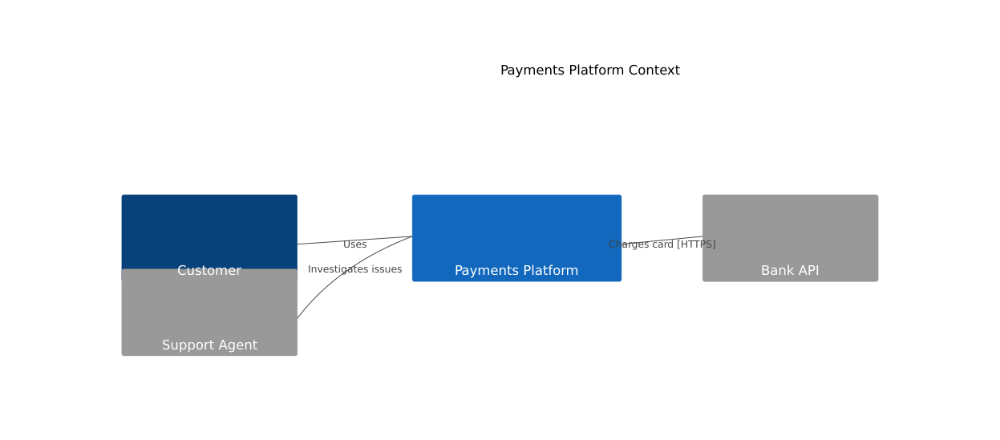

</td>
</tr>
</table>

## class.mmd

<table>
<tr>
<th width="50%%">GitHub Native (Mermaid JS)</th>
<th width="50%%"><code>mmdg</code> PNG</th>
</tr>
<tr>
<td>

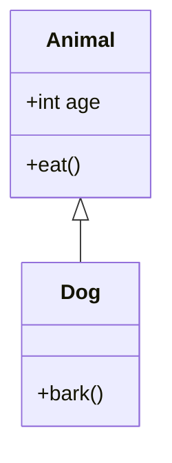
```mermaid
classDiagram
  class Animal {
    +int age
    +eat()
  }
  class Dog {
    +bark()
  }
  Animal <|-- Dog
```

</td>
<td>

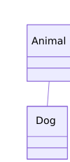

</td>
</tr>
</table>

## class_complex.mmd

<table>
<tr>
<th width="50%%">GitHub Native (Mermaid JS)</th>
<th width="50%%"><code>mmdg</code> PNG</th>
</tr>
<tr>
<td>

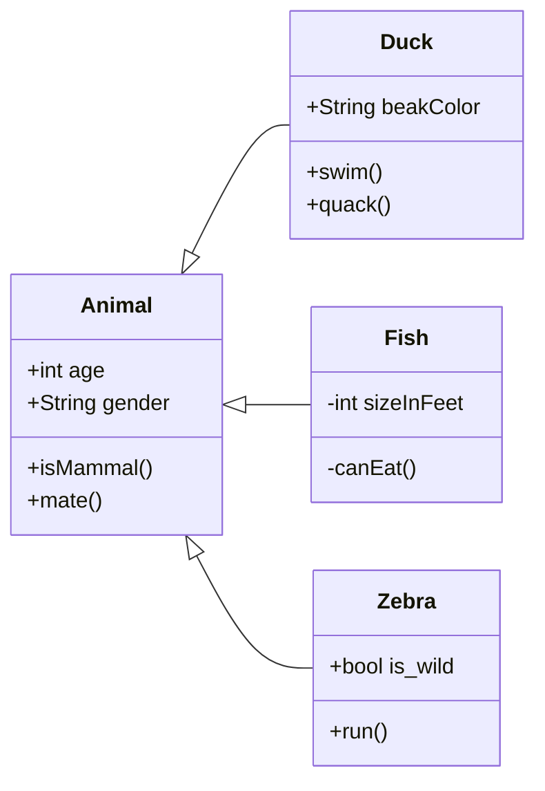
```mermaid
classDiagram
  direction LR
  class Animal {
    +int age
    +String gender
    +isMammal()
    +mate()
  }
  class Duck {
    +String beakColor
    +swim()
    +quack()
  }
  class Fish {
    -int sizeInFeet
    -canEat()
  }
  class Zebra {
    +bool is_wild
    +run()
  }
  Animal <|-- Duck
  Animal <|-- Fish
  Animal <|-- Zebra
```

</td>
<td>

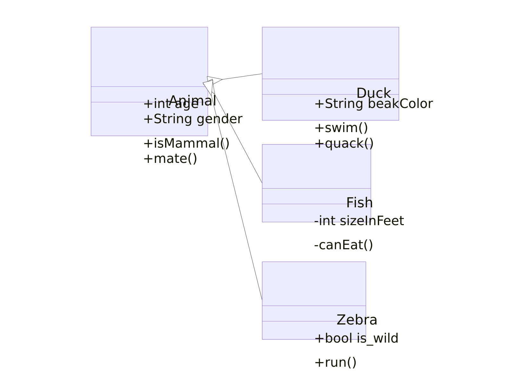

</td>
</tr>
</table>

## er.mmd

<table>
<tr>
<th width="50%%">GitHub Native (Mermaid JS)</th>
<th width="50%%"><code>mmdg</code> PNG</th>
</tr>
<tr>
<td>

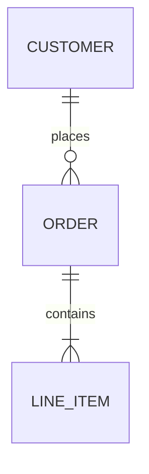
```mermaid
erDiagram
  CUSTOMER ||--o{ ORDER : places
  ORDER ||--|{ LINE_ITEM : contains
```

</td>
<td>

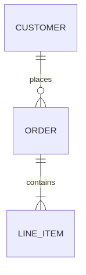

</td>
</tr>
</table>

## er_complex.mmd

<table>
<tr>
<th width="50%%">GitHub Native (Mermaid JS)</th>
<th width="50%%"><code>mmdg</code> PNG</th>
</tr>
<tr>
<td>

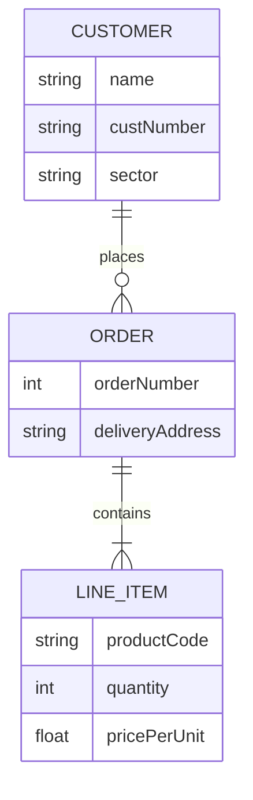
```mermaid
erDiagram
  CUSTOMER ||--o{ ORDER : places
  ORDER ||--|{ LINE_ITEM : contains
  CUSTOMER {
    string name
    string custNumber
    string sector
  }
  ORDER {
    int orderNumber
    string deliveryAddress
  }
  LINE_ITEM {
    string productCode
    int quantity
    float pricePerUnit
  }
```

</td>
<td>

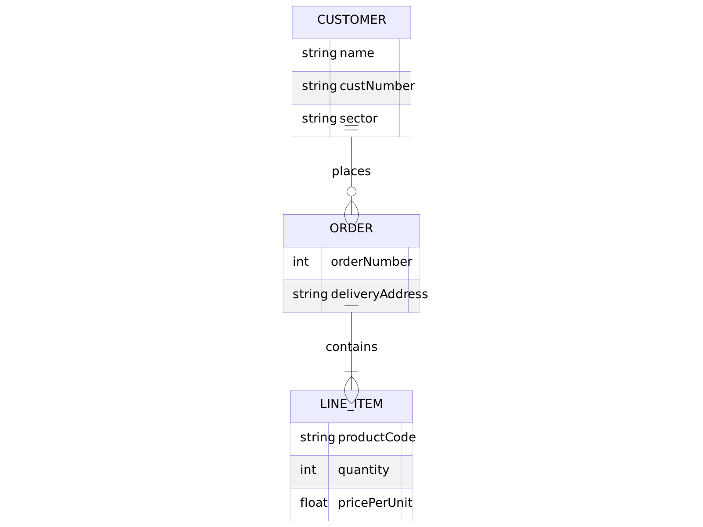

</td>
</tr>
</table>

## flowchart.mmd

<table>
<tr>
<th width="50%%">GitHub Native (Mermaid JS)</th>
<th width="50%%"><code>mmdg</code> PNG</th>
</tr>
<tr>
<td>

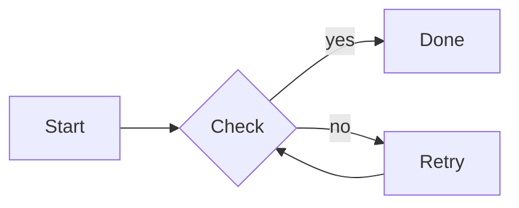
```mermaid
flowchart LR
  A[Start] --> B{Check}
  B -->|yes| C[Done]
  B -->|no| D[Retry]
  D --> B
```

</td>
<td>

</td>
</tr>
</table>

## flowchart_complex.mmd

<table>
<tr>
<th width="50%%">GitHub Native (Mermaid JS)</th>
<th width="50%%"><code>mmdg</code> PNG</th>
</tr>
<tr>
<td>

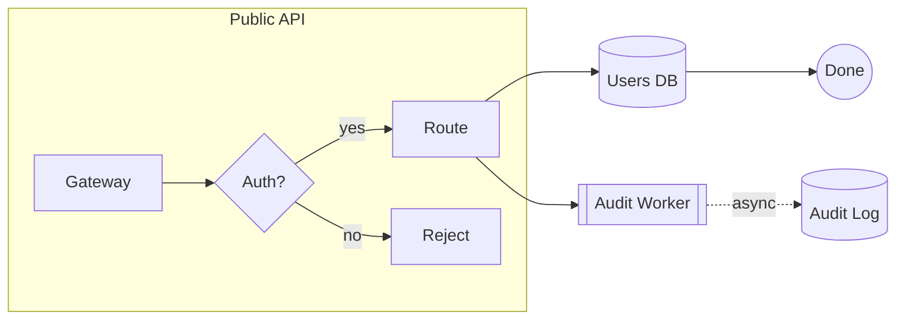
```mermaid
flowchart LR
  subgraph API["Public API"]
    A[Gateway] --> B{Auth?}
    B -->|yes| C[Route]
    B -->|no| D[Reject]
  end
  C --> E[(Users DB)]
  C --> F[[Audit Worker]]
  F -. async .-> G[(Audit Log)]
  E --> H((Done))
```

</td>
<td>

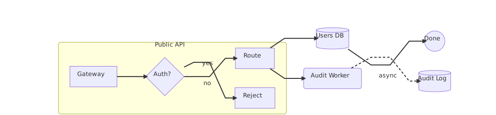

</td>
</tr>
</table>

## gantt.mmd

<table>
<tr>
<th width="50%%">GitHub Native (Mermaid JS)</th>
<th width="50%%"><code>mmdg</code> PNG</th>
</tr>
<tr>
<td>

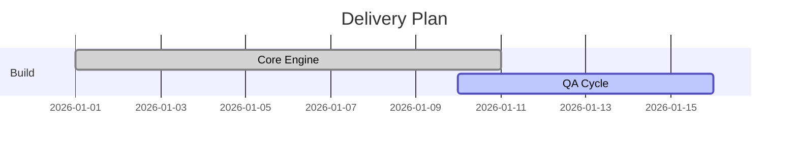
```mermaid
gantt
  title Delivery Plan
  section Build
    Core Engine :done, core, 2026-01-01, 10d
    QA Cycle :active, qa, 2026-01-10, 6d
```

</td>
<td>

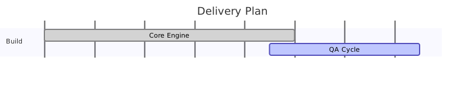

</td>
</tr>
</table>

## gitgraph.mmd

<table>
<tr>
<th width="50%%">GitHub Native (Mermaid JS)</th>
<th width="50%%"><code>mmdg</code> PNG</th>
</tr>
<tr>
<td>

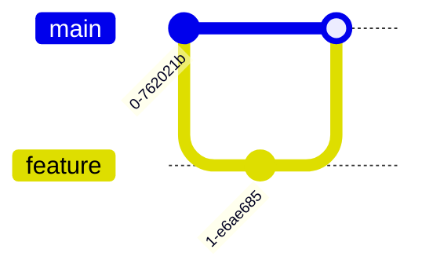
```mermaid
gitGraph
  commit
  branch feature
  checkout feature
  commit
  checkout main
  merge feature
```

</td>
<td>

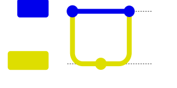

</td>
</tr>
</table>

## gitgraph_complex.mmd

<table>
<tr>
<th width="50%%">GitHub Native (Mermaid JS)</th>
<th width="50%%"><code>mmdg</code> PNG</th>
</tr>
<tr>
<td>

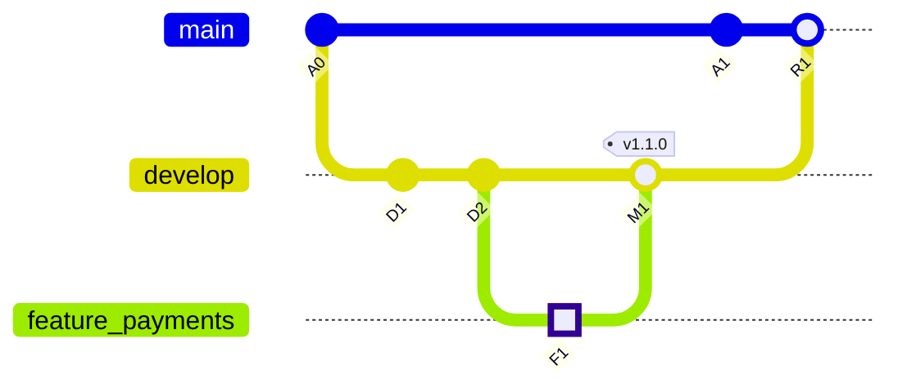
```mermaid
gitGraph
  commit id:"A0"
  branch develop
  checkout develop
  commit id:"D1"
  commit id:"D2"
  branch feature_payments
  checkout feature_payments
  commit id:"F1" type:HIGHLIGHT
  checkout develop
  merge feature_payments id:"M1" tag:"v1.1.0"
  checkout main
  commit id:"A1"
  merge develop id:"R1"
```

</td>
<td>

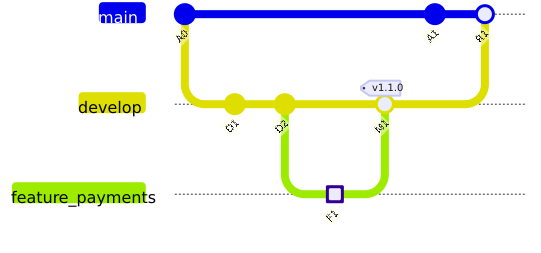

</td>
</tr>
</table>

## journey.mmd

<table>
<tr>
<th width="50%%">GitHub Native (Mermaid JS)</th>
<th width="50%%"><code>mmdg</code> PNG</th>
</tr>
<tr>
<td>

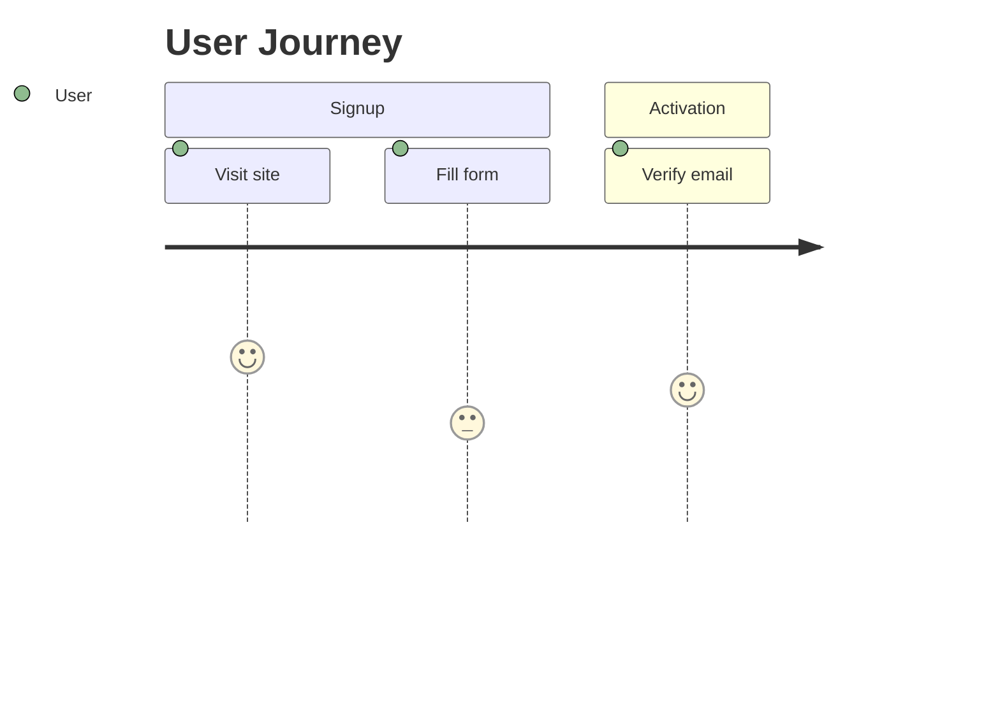
```mermaid
journey
  title User Journey
  section Signup
    Visit site: 5: User
    Fill form: 3: User
  section Activation
    Verify email: 4: User
```

</td>
<td>

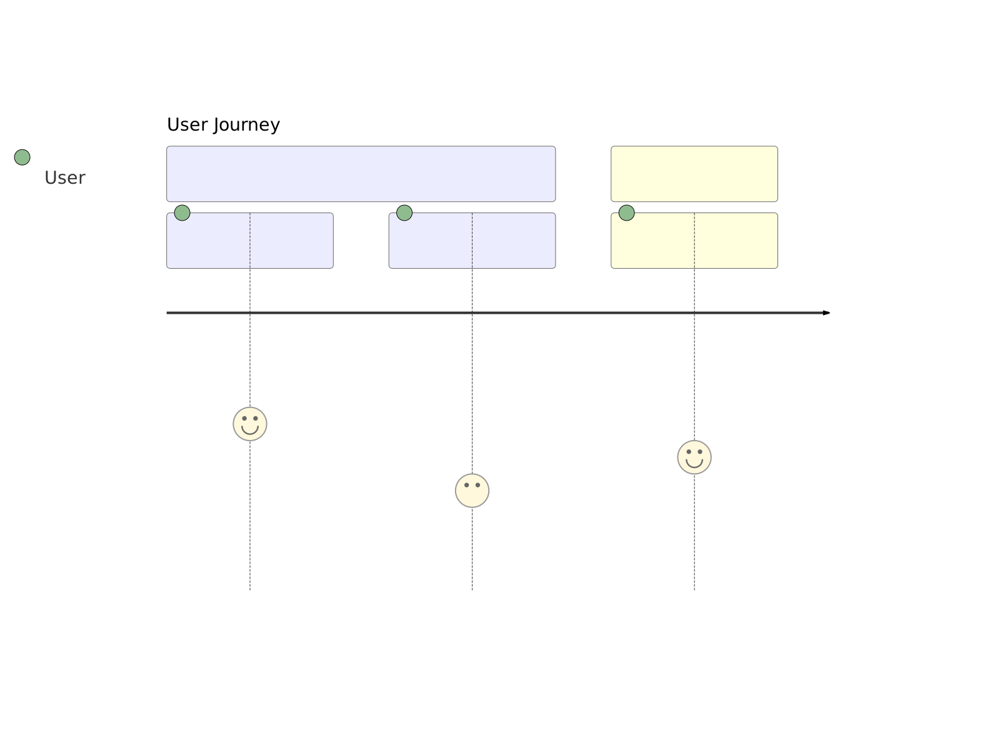

</td>
</tr>
</table>

## journey_complex.mmd

<table>
<tr>
<th width="50%%">GitHub Native (Mermaid JS)</th>
<th width="50%%"><code>mmdg</code> PNG</th>
</tr>
<tr>
<td>

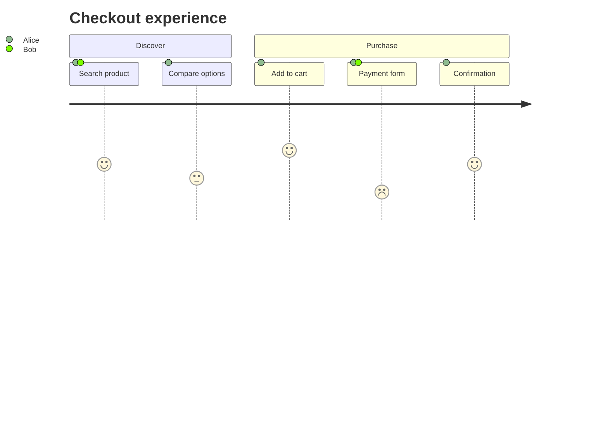
```mermaid
journey
  title Checkout experience
  section Discover
    Search product: 4: Alice, Bob
    Compare options: 3: Alice
  section Purchase
    Add to cart: 5: Alice
    Payment form: 2: Alice, Bob
    Confirmation: 4: Alice
```

</td>
<td>

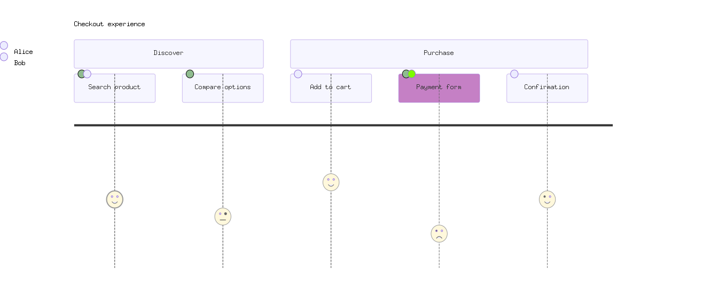

</td>
</tr>
</table>

## kanban_complex.mmd

<table>
<tr>
<th width="50%%">GitHub Native (Mermaid JS)</th>
<th width="50%%"><code>mmdg</code> PNG</th>
</tr>
<tr>
<td>

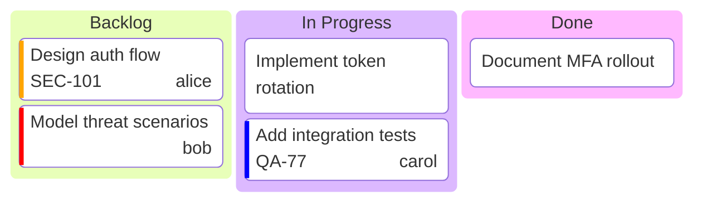
```mermaid
kanban
  Backlog
    t1[Design auth flow]@{ ticket: SEC-101, assigned: "alice", priority: "High" }
    t2[Model threat scenarios]@{ assigned: "bob", priority: "Very High" }
  In Progress
    t3[Implement token rotation]
    t4[Add integration tests]@{ ticket: QA-77, assigned: "carol", priority: "Low" }
  Done
    t5[Document MFA rollout]
```

</td>
<td>

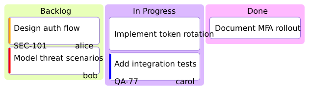

</td>
</tr>
</table>

## mindmap.mmd

<table>
<tr>
<th width="50%%">GitHub Native (Mermaid JS)</th>
<th width="50%%"><code>mmdg</code> PNG</th>
</tr>
<tr>
<td>

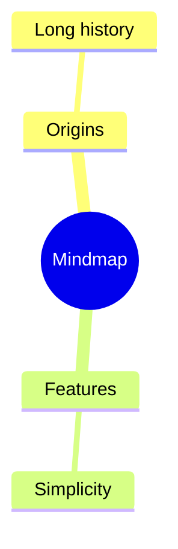
```mermaid
mindmap
  root((Mindmap))
    Origins
      Long history
    Features
      Simplicity
```

</td>
<td>

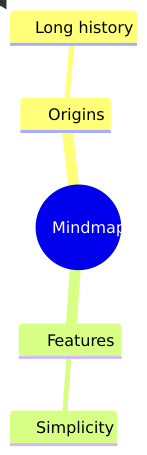

</td>
</tr>
</table>

## mindmap_complex.mmd

<table>
<tr>
<th width="50%%">GitHub Native (Mermaid JS)</th>
<th width="50%%"><code>mmdg</code> PNG</th>
</tr>
<tr>
<td>

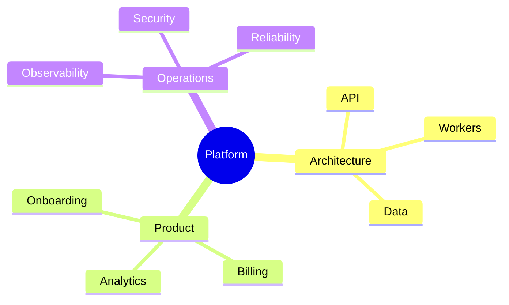
```mermaid
mindmap
  root((Platform))
    Architecture
      API
      Workers
      Data
    Product
      Onboarding
      Billing
      Analytics
    Operations
      Observability
      Security
      Reliability
```

</td>
<td>

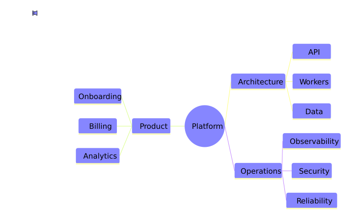

</td>
</tr>
</table>

## packet_complex.mmd

<table>
<tr>
<th width="50%%">GitHub Native (Mermaid JS)</th>
<th width="50%%"><code>mmdg</code> PNG</th>
</tr>
<tr>
<td>

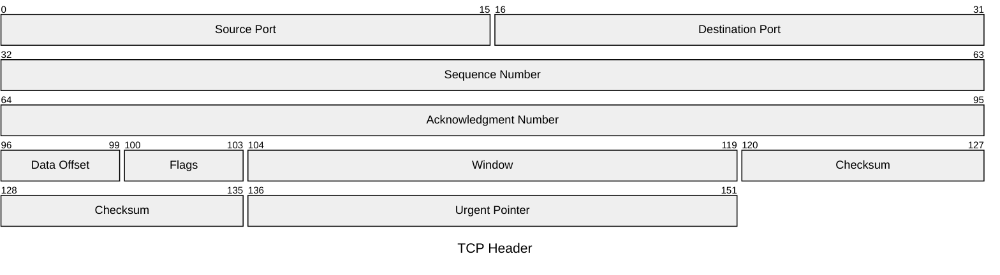
```mermaid
packet
title TCP Header
0-15: "Source Port"
16-31: "Destination Port"
32-63: "Sequence Number"
64-95: "Acknowledgment Number"
96-99: "Data Offset"
100-103: "Flags"
104-119: "Window"
120-135: "Checksum"
136-151: "Urgent Pointer"
```

</td>
<td>

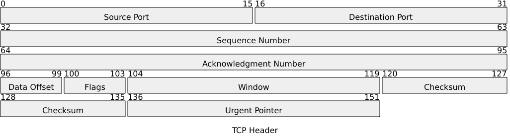

</td>
</tr>
</table>

## pie.mmd

<table>
<tr>
<th width="50%%">GitHub Native (Mermaid JS)</th>
<th width="50%%"><code>mmdg</code> PNG</th>
</tr>
<tr>
<td>

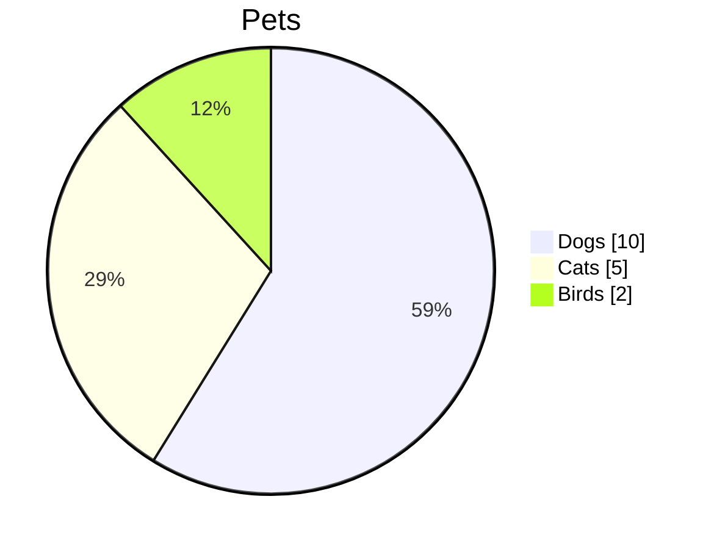
```mermaid
pie showData
  title Pets
  "Dogs" : 10
  "Cats" : 5
  "Birds" : 2
```

</td>
<td>

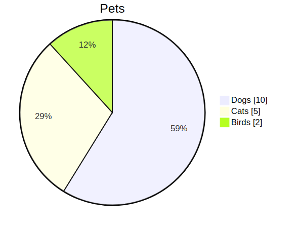

</td>
</tr>
</table>

## pie_complex.mmd

<table>
<tr>
<th width="50%%">GitHub Native (Mermaid JS)</th>
<th width="50%%"><code>mmdg</code> PNG</th>
</tr>
<tr>
<td>

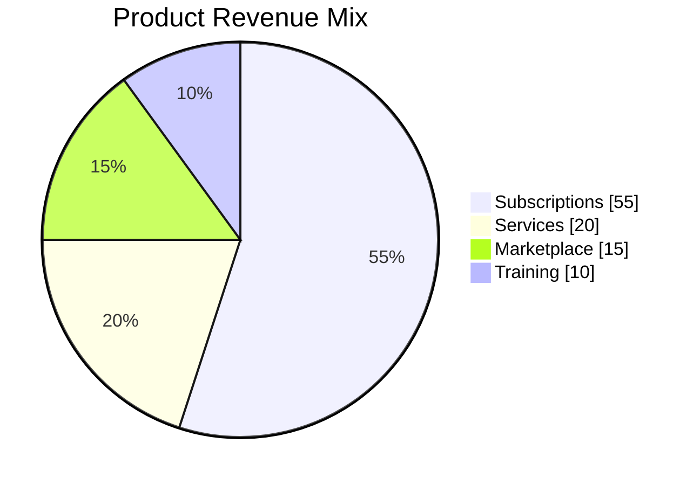
```mermaid
pie showData
  title Product Revenue Mix
  "Subscriptions" : 55
  "Services" : 20
  "Marketplace" : 15
  "Training" : 10
```

</td>
<td>

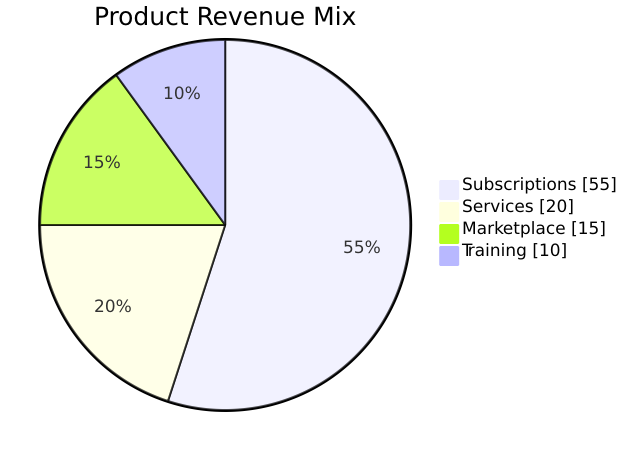

</td>
</tr>
</table>

## quadrant_complex.mmd

<table>
<tr>
<th width="50%%">GitHub Native (Mermaid JS)</th>
<th width="50%%"><code>mmdg</code> PNG</th>
</tr>
<tr>
<td>

```mermaid
quadrantChart
  title Initiative Prioritization
  x-axis Low Effort --> High Effort
  y-axis Low Impact --> High Impact
  quadrant-1 Invest now
  quadrant-2 Stretch goals
  quadrant-3 Avoid
  quadrant-4 Plan later
  SSO rollout: [0.35, 0.85]
  Data residency: [0.78, 0.72]
  UI refresh: [0.42, 0.38]
  Cost optimization: [0.63, 0.44]
```

</td>
<td>

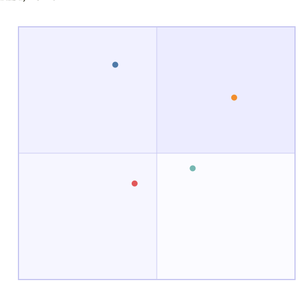

</td>
</tr>
</table>

## radar_complex.mmd

<table>
<tr>
<th width="50%%">GitHub Native (Mermaid JS)</th>
<th width="50%%"><code>mmdg</code> PNG</th>
</tr>
<tr>
<td>

```mermaid
radar-beta
  title Engineering Capability
  axis quality["Quality"], velocity["Velocity"], reliability["Reliability"]
  axis security["Security"], operability["Operability"], ux["UX"]
  curve teamA["Team A"]{82, 76, 88, 70, 79, 68}
  curve teamB["Team B"]{74, 84, 72, 81, 76, 73}
  max 100
  min 0
```

</td>
<td>

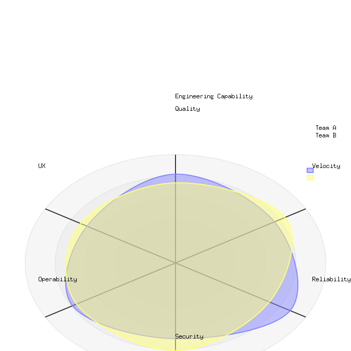

</td>
</tr>
</table>

## requirement_complex.mmd

<table>
<tr>
<th width="50%%">GitHub Native (Mermaid JS)</th>
<th width="50%%"><code>mmdg</code> PNG</th>
</tr>
<tr>
<td>

```mermaid
requirementDiagram
  requirement test_req {
    id: 1
    text: the test text.
    risk: high
    verifymethod: test
  }
  functionalRequirement test_req2 {
    id: 1.1
    text: the second test text.
    risk: low
    verifymethod: inspection
  }
  element test_entity {
    type: simulation
  }
  test_entity - satisfies -> test_req2
  test_req - traces -> test_req2
```

</td>
<td>

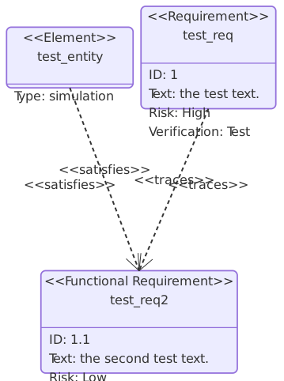

</td>
</tr>
</table>

## sankey_complex.mmd

<table>
<tr>
<th width="50%%">GitHub Native (Mermaid JS)</th>
<th width="50%%"><code>mmdg</code> PNG</th>
</tr>
<tr>
<td>

```mermaid
sankey
Leads,Qualified,120
Qualified,Won,45
Qualified,Lost,75
Won,Expansion,20
Won,Churn,5
```

</td>
<td>

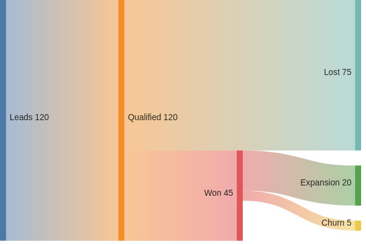

</td>
</tr>
</table>

## sequence.mmd

<table>
<tr>
<th width="50%%">GitHub Native (Mermaid JS)</th>
<th width="50%%"><code>mmdg</code> PNG</th>
</tr>
<tr>
<td>

```mermaid
sequenceDiagram
  participant User
  participant API
  User->>API: Request
  API-->>User: Response
```

</td>
<td>

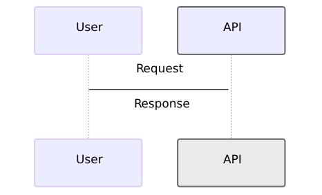

</td>
</tr>
</table>

## sequence_complex.mmd

<table>
<tr>
<th width="50%%">GitHub Native (Mermaid JS)</th>
<th width="50%%"><code>mmdg</code> PNG</th>
</tr>
<tr>
<td>

```mermaid
sequenceDiagram
  participant U as User
  participant W as Web
  participant S as Service
  participant D as DB
  U->>W: Submit order
  W->>+S: validateAndCreate()
  alt valid
    par write order
      S->>+D: insert order
      D-->>-S: order id
    and publish event
      S-->>S: enqueue event
    end
    S-->>W: 201 Created
  else invalid
    S-->>W: 400 Bad Request
  end
  W-->>U: response
```

</td>
<td>

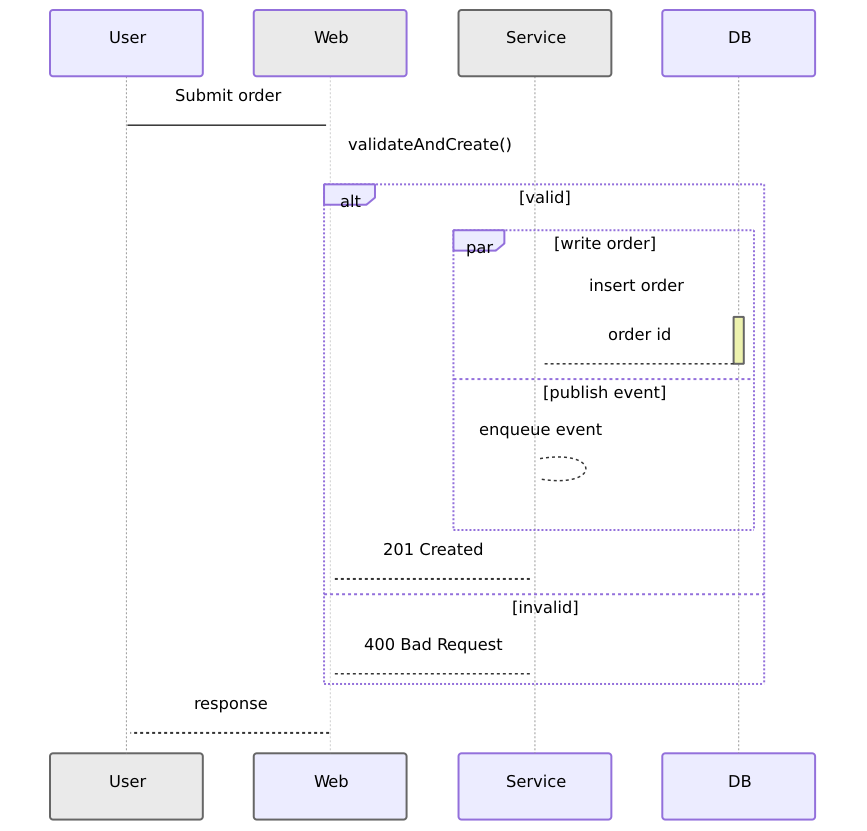

</td>
</tr>
</table>

## state.mmd

<table>
<tr>
<th width="50%%">GitHub Native (Mermaid JS)</th>
<th width="50%%"><code>mmdg</code> PNG</th>
</tr>
<tr>
<td>

```mermaid
stateDiagram-v2
  [*] --> Idle
  Idle --> Running
  Running --> [*]
```

</td>
<td>

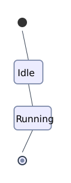

</td>
</tr>
</table>

## state_complex.mmd

<table>
<tr>
<th width="50%%">GitHub Native (Mermaid JS)</th>
<th width="50%%"><code>mmdg</code> PNG</th>
</tr>
<tr>
<td>

```mermaid
stateDiagram-v2
  [*] --> Idle
  Idle --> Validate: submit
  state Validate {
    [*] --> CheckSchema
    CheckSchema --> CheckAuth
    CheckAuth --> [*]
  }
  Validate --> Approved: ok
  Validate --> Rejected: fail
  state Review <<choice>>
  Approved --> Review
  Review --> Fulfilled: auto
  Review --> Escalated: manual
  Escalated --> Fulfilled
  Fulfilled --> [*]
  Rejected --> [*]
```

</td>
<td>

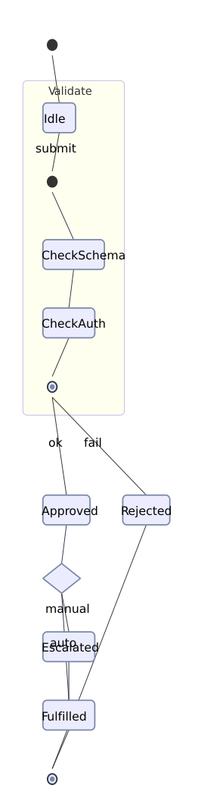

</td>
</tr>
</table>

## timeline.mmd

<table>
<tr>
<th width="50%%">GitHub Native (Mermaid JS)</th>
<th width="50%%"><code>mmdg</code> PNG</th>
</tr>
<tr>
<td>

```mermaid
timeline
  title Product Timeline
  2024 : alpha
  2025 : beta : ga
```

</td>
<td>

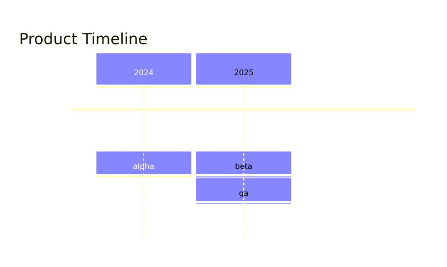

</td>
</tr>
</table>

## timeline_complex.mmd

<table>
<tr>
<th width="50%%">GitHub Native (Mermaid JS)</th>
<th width="50%%"><code>mmdg</code> PNG</th>
</tr>
<tr>
<td>

```mermaid
timeline
  title Platform milestones
  section Foundation
    2019 : MVP
    2020 : GA : First 100 customers
  section Scale
    2021 : Multi-region
    2022 : Enterprise controls : SSO
    2023 : AI features
```

</td>
<td>

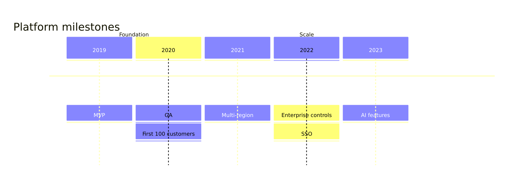

</td>
</tr>
</table>

## treemap_complex.mmd

<table>
<tr>
<th width="50%%">GitHub Native (Mermaid JS)</th>
<th width="50%%"><code>mmdg</code> PNG</th>
</tr>
<tr>
<td>

```mermaid
treemap-beta
"Revenue"
  "SMB"
    "Self-serve": 140
    "Inside sales": 95
  "Enterprise"
    "New business": 180
    "Expansion": 130
  "Partners"
    "Resellers": 70
    "Marketplace": 55
```

</td>
<td>

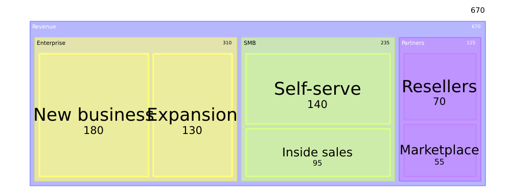

</td>
</tr>
</table>

## xychart.mmd

<table>
<tr>
<th width="50%%">GitHub Native (Mermaid JS)</th>
<th width="50%%"><code>mmdg</code> PNG</th>
</tr>
<tr>
<td>

```mermaid
xychart-beta
  title "Monthly Revenue"
  x-axis [Jan, Feb, Mar, Apr]
  y-axis "USD" 0 --> 100
  line [20, 35, 65, 90]
```

</td>
<td>

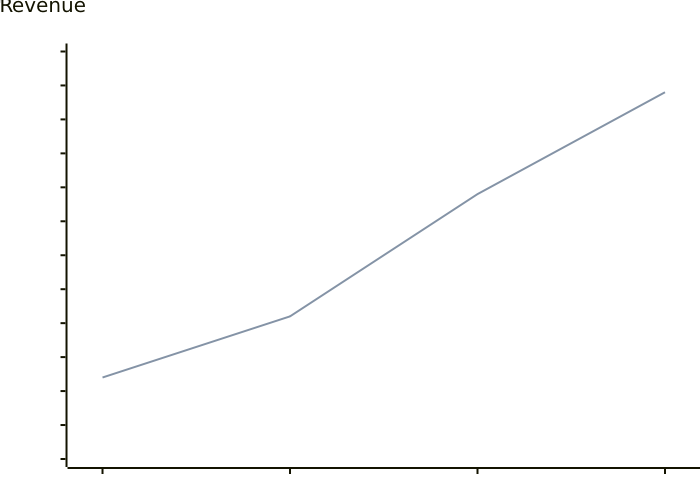

</td>
</tr>
</table>

## xychart_complex.mmd

<table>
<tr>
<th width="50%%">GitHub Native (Mermaid JS)</th>
<th width="50%%"><code>mmdg</code> PNG</th>
</tr>
<tr>
<td>

```mermaid
xychart-beta
  title "Revenue and Growth"
  x-axis [Q1, Q2, Q3, Q4, Q5, Q6]
  y-axis "ARR (k$)" 0 --> 240
  bar [40, 75, 110, 145, 180, 220]
  line [38, 70, 105, 142, 176, 215]
```

</td>
<td>

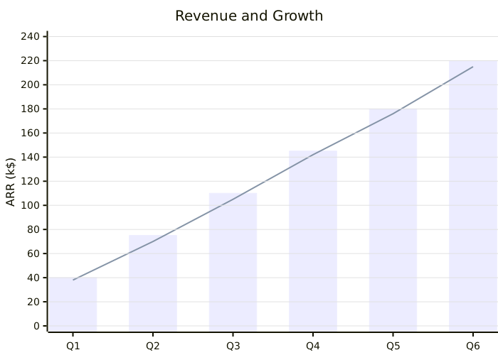

</td>
</tr>
</table>

## zenuml_complex.mmd

<table>
<tr>
<th width="50%%">GitHub Native (Mermaid JS)</th>
<th width="50%%"><code>mmdg</code> PNG</th>
</tr>
<tr>
<td>

```mermaid
zenuml
  title Order orchestration
  Customer->Gateway: createOrder()
  Gateway->OrderService: create()
  OrderService->Inventory: reserve()
  if(reserved) {
    OrderService->Payment: charge()
    Payment->OrderService: ok
    @return
    OrderService->Customer: confirmed
  } else {
    OrderService->Customer: rejected
  }
```

</td>
<td>

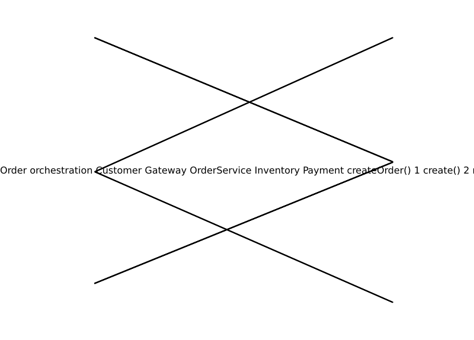

</td>
</tr>
</table>

